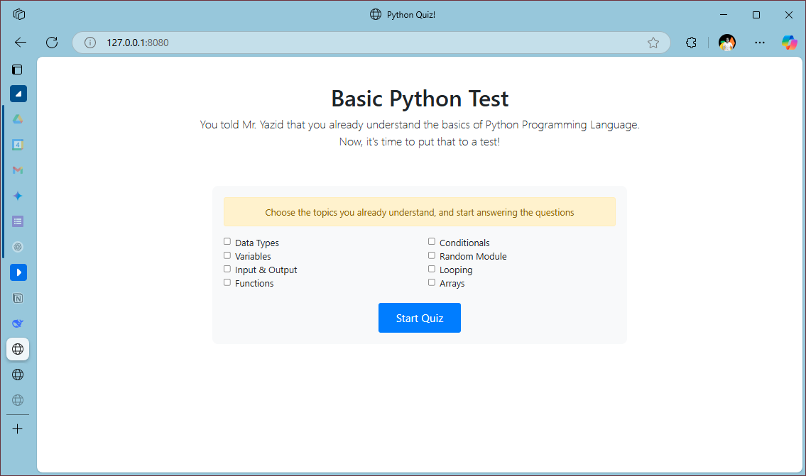
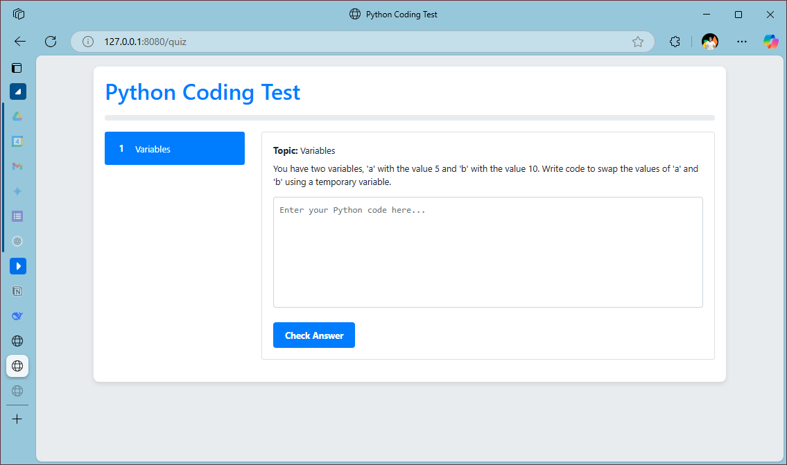

# 🐍 "Oh, You Understand Python?" - The Teacher's Truth Detector
### Because "Yes, I understand" doesn't always mean "Yes, I actually understand"

## 📖 The Backstory (aka Why I Built This)
Picture this: You just finished an amazing Python lesson. You ask the class:
"Any questions?" → Silence.
"Everyone understands?" → Nods all around.

Next class:
"So who remembers how to write a function?"
...crickets...
"The thing we spent 45 minutes on yesterday?"
blank stares

That's when I decided to build this sneaky little quiz - because actions speak louder than students nodding along while secretly confused!

Python Quiz Screenshot

## 🎯 What This Does
A Flask web app that:

- Lets students claim they understand Python topics
- Tests them immediately on those exact topics
- Gives me that sweet, sweet "I told you so" data when they struggle

Built with:
- Python 🐍
- Flask 🍵 (because I just learned it and wanted to play)

## ✨ Features
For Students:
- "I know this!" checkbox selection (famous last words)
- Code challenges that look simple... until you try them

For Teachers:
- Reality-check generator
- Topic-based questions (variables, functions, loops, etc.)
- Basic answer validation (not perfect, but catches the obvious "I have no clue" attempts)

## 💻 How It Works
1. Student selects topics they "understand":
Topic Selection
2. Gets served coding challenges:
Quiz Interface
3. System judges them (kindly but firmly):
Feedback

## 🔜 Coming Soon (Because Teachers Never Stop Improving)
- More Case study - Because real-world mistakes > textbook examples
- Data tracking - CSV exports of "how many times students were wrong about understanding loops" etc
- IDE-style error highlighting - So no more question this is correct but it says it's not?
- Better UI - Letme Strenghten my Bootstrap and CSS skills

## 📬 Contact
Made with ❤️ by Ahmad Yazid
(if you had suggestion of what I can improve, get to me by the link on my bio!)

